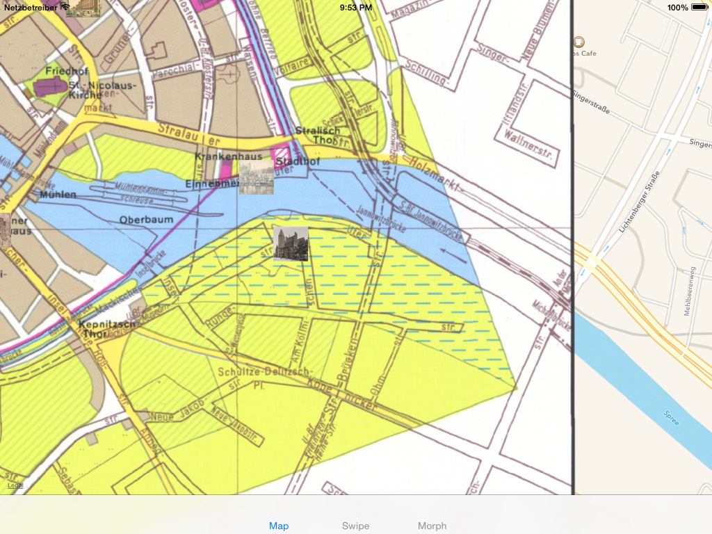

Wer wissen will, wie es weiter geht mit diesem Projekt kann sich auf der [Alt-Berlin Webseite](http://altberlinapp.de) für unseren Newsletter anmelden.

Geocodierte Bilder
==================

[Die Bilder des Stadtmuseums Berlin](https://commons.wikimedia.org/wiki/Category:Stadtansichten_%28Stiftung_Stadtmuseum_Berlin%29) mit geografischen Koordinaten und animiert basierend auf der Entstehungszeit der abgebildeten Gebäude. Der Zeitslider unten im Bild geht vom Jahr 1400 bis zum Jahr 2000.


Karten Overlays
===============

[Berliner Karte von 1650](http://www.stadtentwicklung.berlin.de/geoinformation/geodateninfrastruktur/de/geodienste/atom.shtml) als Overlay auf aktueller Karte.



Werkzeuge: [gdal 1.11](http://www.gdal.org/), [epsg.io](http://epsg.io/3068/map)
Reihenfolge: oben links, unten links, oben rechts, unten rechts

````
gdalinfo Berlin1650.tif

gdal_translate -of VRT -a_srs EPSG:3068 \
-gcp 0 0 23100 22600 \
-gcp 0 3511 23100 19600 \
-gcp 3678 0 26300 22600 \
-gcp 3678 3511 26300 19600 \
Berlin1650.tif Berlin1650.vrt

gdal2tiles.py -p mercator -k Berlin1650.vrt
````

Geometrien
==========

[Geometrien der Ortsteile Berlins](http://daten.berlin.de/datensaetze/geometrien-der-ortsteile-von-berlin-stand-072012)

````
npm install -g togeojson

togeojson Berlin-Ortsteile.kml > Berlin.geojson
````


