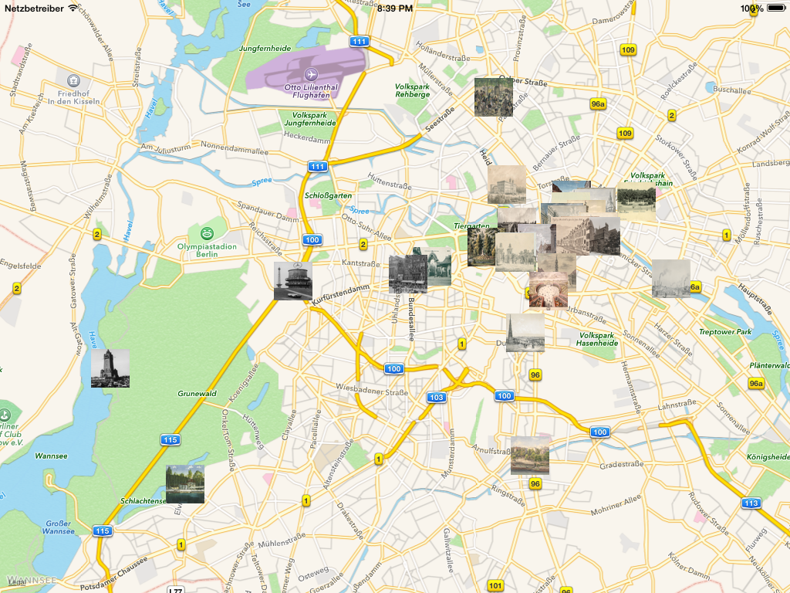

Geocodierte Bilder
==================

[Die Bilder des Stadtmuseums Berlin](https://commons.wikimedia.org/wiki/Category:Stadtansichten_%28Stiftung_Stadtmuseum_Berlin%29) mit [geografischen Koordinaten](https://github.com/choefele/coding-da-vinci/blob/master/Coding%20Da%20Vinci/ViewController.m#L21).

Karten Overlays
===============

[Berliner Karte von 1650](http://www.stadtentwicklung.berlin.de/geoinformation/geodateninfrastruktur/de/geodienste/atom.shtml) als Overlay auf aktueller Karte.

